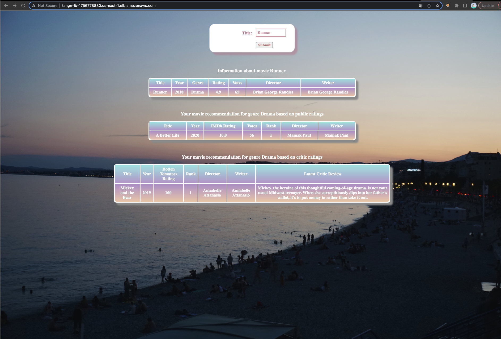
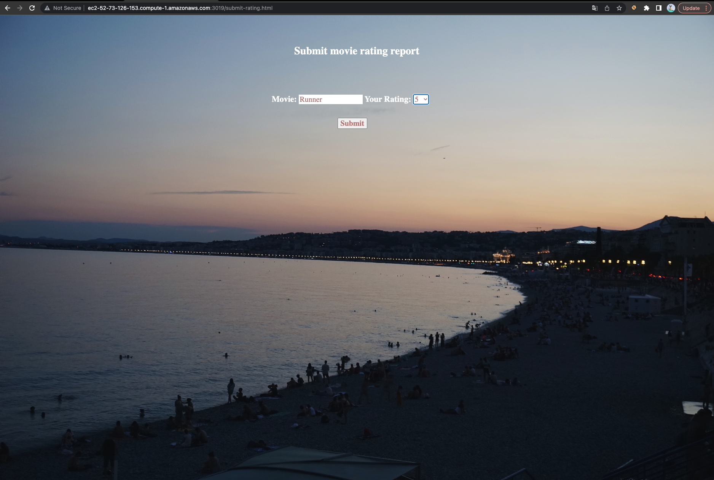

# Big-Data-Movie-Recommendation

This project is designed for providing movie recommendations based on both public ratings (IMDb) and critics ratings (Rotten Tomatoes). My idea is, once a user finds that they like one movie, they may want to keep watching other movies within the same genre. By searching the movie title, they could first get more detailed information about the movie they like (and submit their own movie ratings to update the public ratings of this movie). Based on the genre of the input movie, they could also receive recommendations about what to watch next from both public perspective and critics perspective.

## How to Use
I have depolyed my web application to loadbalancer webservers. Please follow this link to check my web app.
http://tangn-lb-1756778830.us-east-1.elb.amazonaws.com/

Additionaly, you could also check my web app by:
* Connect to EC2
* `cd tangn/movieapp`
* `node app.js 3019 ec2-54-166-56-39.compute-1.amazonaws.com 8070 b-2.mpcs530142022.7vr20l.c19.kafka.us-east-1.amazonaws.com:9092,b-1.mpcs530142022.7vr20l.c19.kafka.us-east-1.amazonaws.com:9092,b-3.mpcs530142022.7vr20l.c19.kafka.us-east-1.amazonaws.com:9092`
* My homepage runs at http://ec2-52-73-126-153.compute-1.amazonaws.com:3019/
* The `submit-rating.html` runs at http://ec2-52-73-126-153.compute-1.amazonaws.com:3019/submit-rating.html

To run the speed layer:
* Connect to Hadoop
* `cd tangn/slw/target/`
* `spark-submit --master local[2] --driver-java-options "-Dlog4j.configuration=file:///home/hadoop/ss.log4j.properties" --class StreamRating uber-speedlayer-1.0-SNAPSHOT.jar b-3.mpcs530142022.7vr20l.c19.kafka.us-east-1.amazonaws.com:9092,b-1.mpcs530142022.7vr20l.c19.kafka.us-east-1.amazonaws.com:9092,b-2.mpcs530142022.7vr20l.c19.kafka.us-east-1.amazonaws.com:9092`

## Data 

Five datasets are used in this project. 
* title dataset contains information such as year, genre for titles.
* crew dataset contains the director and writer id for titles.
* ratings dataset contains the IMDb rating and votes information for titles.
* name dataset contains names for people ids.
* rotten tomatoes dataset contains year, critic ratings, and latest critic reviews for titles.
The first four datasets are downloaded from [IMDb](https://datasets.imdbws.com/). 
The last dataset is scraped by myself from [Rotten Tomatoes](https://www.rottentomatoes.com/), see scraper code in `scrape_rotten.py`. Note that it may take serveral days to finish the scraping process since the database has over 600k movies. I have attached the scraped data in `rotten_tomato_data.csv`.

## Structure

This project follows the Lambda architecture. Three layers are included.

### Batch Layer
The batch layer stores master datasets in HDFS and uses Hive to reencode them as ORC format `hive_crew.hql`, `hive_name.hql`, `hive_rating.hql`, `hive_rotten.hql`, `hive_title.hql`.

### Serving Layer
The serving layer uses Spark to query tables and creates batch views `batch_views.scala`, then writes them into HBase `write_to_hbase.hql` for the use of my web application.

### Speed Layer
I create a web page named `./sumbit-rating.html`, where users could input the movie they would like to rate and give ratings from 1-10. After submission, it would recompute the new batch view and update the average rating and number of votes of this movie in the homepage. 
To achieve this, I first create a Kafka topic `tangn-public-rating` and write code in `app.js` to get real-time data into Kafka message queue. I then wrote a streaming program `speedlayer` to process the Kafka report and update the latest rating in the `tangn_movie` HBase table.

## Preview

